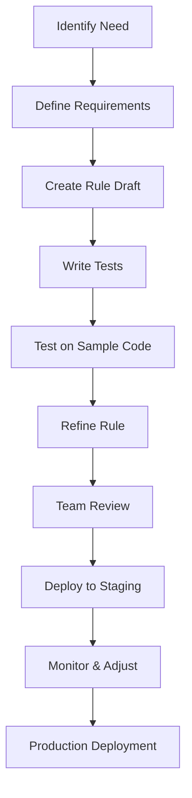

# Chapter 11: Custom Quality Rules

<!-- DOC_STATUS_START -->
**Chapter Status**: ✅ 100% Working (8/8 examples)

| Status | Count | Examples |
|--------|-------|----------|
| ✅ Working | 8 | All custom rule configurations tested |
| ⚠️ Not Implemented | 0 | Planned for future versions |
| ❌ Broken | 0 | Known issues, needs fixing |
| 📋 Planned | 0 | Future roadmap features |

*Last updated: 2025-10-26*  
*PMAT version: pmat 2.213.1*  
*Test-Driven: All examples validated in `tests/ch11/test_custom_rules.sh`*
<!-- DOC_STATUS_END -->

## Beyond Standard Rules: Creating Custom Quality Gates

While PMAT comes with comprehensive built-in quality rules, every team and project has unique requirements. PMAT's custom rule system lets you define project-specific quality standards, enforce architectural patterns, and create team-specific quality gates.

## Why Custom Rules?

Standard linting catches syntax errors and common issues. Custom PMAT rules enable:
- **Architectural Enforcement**: Ensure adherence to design patterns
- **Business Logic Validation**: Check domain-specific requirements
- **Team Standards**: Enforce organization-specific coding practices
- **Security Policies**: Implement company-specific security rules
- **Performance Guidelines**: Enforce performance-critical patterns

## Rule Types

PMAT supports several types of custom rules:

### 1. Pattern-Based Rules
Match code patterns using regular expressions or AST patterns.

### 2. Metric-Based Rules
Define thresholds for complexity, size, and other measurable qualities.

### 3. Dependency Rules
Control imports, dependencies, and architectural boundaries.

### 4. Semantic Rules
Analyze code meaning and behavior, not just structure.

### 5. Cross-File Rules
Validate consistency across multiple files and modules.

## Quick Start

Create your first custom rule in 5 minutes:

```bash
# Initialize custom rules directory
pmat rules init

# Create a simple rule
pmat rules create --name "no-print-statements" --language python

# Test the rule
pmat rules test no-print-statements

# Apply to your project
pmat analyze . --rules custom
```

## Rule Definition Language

PMAT uses YAML for rule definitions, supporting multiple matching strategies:

### Basic Rule Structure

```yaml
# .pmat/rules/basic-example.yaml
name: "no-hardcoded-secrets"
description: "Prevent hardcoded API keys and secrets"
severity: "error"
category: "security"
languages: ["python", "javascript", "java", "go"]

patterns:
  - regex: '(api_key|secret_key|password)\s*=\s*["\'][^"\']{20,}["\']'
    message: "Hardcoded secret detected"
    
  - regex: 'Bearer\s+[A-Za-z0-9]{40,}'
    message: "Hardcoded Bearer token found"

fixes:
  - suggestion: "Use environment variables: os.environ.get('API_KEY')"
  - suggestion: "Use configuration files with proper access controls"

examples:
  bad: |
    api_key = "sk-1234567890abcdef1234567890abcdef"
    
  good: |
    api_key = os.environ.get('API_KEY')
    
metadata:
  created_by: "security-team"
  created_date: "2025-01-15"
  tags: ["security", "secrets", "hardcoded"]
```

### Advanced Pattern Matching

```yaml
# .pmat/rules/complex-patterns.yaml
name: "enforce-error-handling"
description: "Ensure proper error handling in critical functions"
severity: "warning"
languages: ["python"]

ast_patterns:
  - pattern: |
      def $func_name($params):
          $body
    where:
      - $func_name matches: "(save|delete|update|create)_.*"
      - not contains: "try:"
      - not contains: "except:"
    message: "Critical functions must include error handling"

contextual_rules:
  - when: "function_name.startswith('save_')"
    require: ["try_except_block", "logging_statement"]
    
  - when: "function_calls_external_api"
    require: ["timeout_handling", "retry_logic"]

file_scope_rules:
  - pattern: "class.*Repository"
    requires:
      - "at_least_one_method_with_error_handling"
      - "connection_cleanup_in_destructor"
```

## Real-World Custom Rules

### 1. Microservices Architecture Rule

```yaml
# .pmat/rules/microservice-boundaries.yaml
name: "microservice-boundaries"
description: "Enforce microservice architectural boundaries"
severity: "error"
category: "architecture"

cross_file_rules:
  - name: "no-direct-db-access"
    description: "Services should only access their own database"
    pattern: |
      from $service_name.models import $model
    where:
      - current_file not in: "$service_name/**"
    message: "Direct database access across service boundaries"
    
  - name: "api-communication-only"
    description: "Inter-service communication must use APIs"
    ast_pattern: |
      import $module
    where:
      - $module matches: "(user_service|order_service|payment_service)\\.(?!api)"
    message: "Use API endpoints for inter-service communication"

dependency_rules:
  allowed_imports:
    "user_service/**":
      - "shared.utils.*"
      - "user_service.*"
      - "api_client.*"
    "order_service/**":
      - "shared.utils.*"  
      - "order_service.*"
      - "api_client.*"
      
  forbidden_imports:
    "user_service/**":
      - "order_service.models.*"
      - "payment_service.database.*"
```

### 2. Performance Critical Code Rule

```yaml
# .pmat/rules/performance-critical.yaml
name: "performance-critical-code"
description: "Enforce performance standards in critical paths"
severity: "warning"
category: "performance"

metric_rules:
  - name: "hot-path-complexity"
    description: "Hot paths must have low complexity"
    applies_to:
      - functions_with_decorator: "@performance_critical"
      - files_matching: "*/hot_paths/*"
    thresholds:
      cyclomatic_complexity: 5
      cognitive_complexity: 8
      max_depth: 3
      
  - name: "no-inefficient-operations"
    description: "Avoid inefficient operations in performance critical code"
    patterns:
      - regex: '\.sort\(\)'
        context: "@performance_critical"
        message: "Sorting in hot path - consider pre-sorted data"
        
      - ast_pattern: |
          for $var in $iterable:
              if $condition:
                  $body
        context: "function_has_decorator('@performance_critical')"
        message: "Consider list comprehension or generator"

benchmarking:
  required_for:
    - functions_with_decorator: "@performance_critical"
  benchmark_file: "benchmarks/test_{function_name}.py"
  performance_regression_threshold: "10%"
```

### 3. Team Coding Standards Rule

```yaml
# .pmat/rules/team-standards.yaml  
name: "team-coding-standards"
description: "Enforce team-specific coding practices"
severity: "info"
category: "style"

documentation_rules:
  - name: "public-api-docs"
    description: "Public APIs must have comprehensive documentation"
    applies_to:
      - classes_with_decorator: "@public_api"
      - functions_starting_with: "api_"
    requires:
      - docstring_with_args
      - docstring_with_return_type  
      - docstring_with_examples
      - type_annotations

  - name: "complex-function-docs"
    description: "Complex functions need detailed documentation"
    applies_to:
      - cyclomatic_complexity: "> 8"
      - function_length: "> 30"
    requires:
      - docstring_with_algorithm_explanation
      - docstring_with_time_complexity

naming_conventions:
  constants: "UPPER_SNAKE_CASE"
  classes: "PascalCase"
  functions: "snake_case"
  private_methods: "_snake_case"
  
  custom_patterns:
    database_models: ".*Model$"
    test_functions: "test_.*"
    fixture_functions: ".*_fixture$"

git_integration:
  pr_requirements:
    - "all_custom_rules_pass"
    - "documentation_coverage >= 80%"
    - "no_todo_comments_in_production_code"
```

## Language-Specific Rules

### Python Rules

```yaml
# .pmat/rules/python-specific.yaml
name: "python-best-practices"
description: "Python-specific quality rules"
languages: ["python"]

python_rules:
  - name: "proper-exception-handling"
    description: "Use specific exception types"
    patterns:
      - regex: 'except:'
        message: "Use specific exception types instead of bare except"
        
      - regex: 'except Exception:'
        message: "Catch specific exceptions when possible"
        
  - name: "dataclass-over-namedtuple"
    description: "Prefer dataclasses for complex data structures"
    ast_pattern: |
      from collections import namedtuple
      $name = namedtuple($args)
    where:
      - field_count: "> 5"
    message: "Consider using @dataclass for complex structures"
    
  - name: "async-proper-usage"
    description: "Async functions should use await"
    ast_pattern: |
      async def $name($params):
          $body
    where:
      - not contains: "await"
      - function_length: "> 5"
    message: "Async function should contain await statements"

type_checking:
  require_type_hints:
    - "public_functions"
    - "class_methods"
    - "functions_with_complexity > 5"
    
  mypy_integration:
    strict_mode: true
    check_untyped_defs: true
```

### JavaScript/TypeScript Rules

```yaml
# .pmat/rules/javascript-specific.yaml
name: "javascript-modern-practices"
description: "Modern JavaScript/TypeScript practices"
languages: ["javascript", "typescript"]

modern_javascript:
  - name: "prefer-async-await"
    description: "Use async/await over Promise chains"
    patterns:
      - regex: '\.then\(.*\.then\('
        message: "Consider using async/await for multiple Promise chains"
        
  - name: "const-over-let"
    description: "Prefer const for immutable values"
    ast_pattern: |
      let $var = $value;
    where:
      - variable_never_reassigned: true
    message: "Use const for variables that are never reassigned"
    
  - name: "destructuring-assignments"
    description: "Use destructuring for object properties"
    patterns:
      - regex: 'const \w+ = \w+\.\w+;\s*const \w+ = \w+\.\w+;'
        message: "Consider using destructuring assignment"

react_specific:
  - name: "hooks-rules"
    description: "Enforce React Hooks rules"
    file_patterns: ["*.jsx", "*.tsx"]
    rules:
      - pattern: "use\\w+\\("
        context: "inside_condition"
        message: "Hooks cannot be called conditionally"
        
      - pattern: "useState\\(.*\\)"
        requires: "component_function"
        message: "Hooks can only be called in React components"

typescript_specific:
  strict_types:
    - "no_any_types"
    - "explicit_return_types_for_exported_functions"
    - "prefer_readonly_arrays"
```

## Rule Testing Framework

PMAT provides comprehensive testing for custom rules:

### Unit Testing Rules

```python
# tests/rules/test_no_hardcoded_secrets.py
import pytest
from pmat.rules.testing import RuleTester

class TestHardcodedSecretsRule:
    def setup_method(self):
        self.tester = RuleTester("no-hardcoded-secrets")
    
    def test_detects_api_key(self):
        code = '''
        api_key = "sk-1234567890abcdef1234567890abcdef"
        '''
        violations = self.tester.test_code(code)
        assert len(violations) == 1
        assert "Hardcoded secret detected" in violations[0].message
    
    def test_allows_env_variables(self):
        code = '''
        api_key = os.environ.get('API_KEY')
        '''
        violations = self.tester.test_code(code)
        assert len(violations) == 0
    
    def test_detects_bearer_token(self):
        code = '''
        headers = {"Authorization": "Bearer abc123def456ghi789"}
        '''
        violations = self.tester.test_code(code)
        assert len(violations) == 1
        
    def test_ignores_short_strings(self):
        code = '''
        test_key = "short"
        '''
        violations = self.tester.test_code(code)
        assert len(violations) == 0

    @pytest.mark.parametrize("language", ["python", "javascript", "java"])
    def test_cross_language_support(self, language):
        code_samples = {
            "python": 'api_key = "sk-1234567890abcdef1234567890abcdef"',
            "javascript": 'const apiKey = "sk-1234567890abcdef1234567890abcdef";',
            "java": 'String apiKey = "sk-1234567890abcdef1234567890abcdef";'
        }
        
        violations = self.tester.test_code(code_samples[language], language=language)
        assert len(violations) == 1
```

### Integration Testing

```bash
#!/bin/bash
# tests/rules/integration_test.sh

set -e

echo "Testing custom rules integration..."

# Setup test project
TEST_DIR=$(mktemp -d)
cd "$TEST_DIR"

# Create project with violations
cat > main.py << 'EOF'
# This file contains intentional violations for testing

api_key = "sk-1234567890abcdef1234567890abcdef"  # Should trigger rule

def save_user(user):  # Missing error handling
    user.save()

async def process_async():  # Async without await
    return "done"
EOF

# Copy custom rules
cp -r ~/.pmat/rules .pmat/rules

# Run PMAT with custom rules
pmat analyze . --rules=custom --format=json > results.json

# Verify violations were detected
VIOLATIONS=$(jq '.violations | length' results.json)
if [ "$VIOLATIONS" -lt 3 ]; then
    echo "❌ Expected at least 3 violations, got $VIOLATIONS"
    exit 1
fi

# Verify specific rule violations
SECRET_VIOLATIONS=$(jq '.violations[] | select(.rule == "no-hardcoded-secrets") | length' results.json)
ERROR_VIOLATIONS=$(jq '.violations[] | select(.rule == "enforce-error-handling") | length' results.json)

if [ "$SECRET_VIOLATIONS" -eq 0 ]; then
    echo "❌ Secret detection rule not working"
    exit 1
fi

if [ "$ERROR_VIOLATIONS" -eq 0 ]; then
    echo "❌ Error handling rule not working"  
    exit 1
fi

echo "✅ All custom rules working correctly"
```

## Rule Management CLI

PMAT provides comprehensive CLI tools for managing custom rules:

### Creating Rules

```bash
# Interactive rule creation
pmat rules create --interactive

# Template-based creation
pmat rules create --template security-rule --name detect-sql-injection

# From existing code analysis
pmat rules generate --from-violations --project-path ./src

# Language-specific templates
pmat rules create --template python-performance --name optimize-loops
```

### Testing Rules

```bash
# Test single rule
pmat rules test no-hardcoded-secrets

# Test all custom rules
pmat rules test --all

# Test against specific files
pmat rules test --files "src/**/*.py"

# Performance testing
pmat rules benchmark --rule performance-critical-code --iterations 1000
```

### Rule Distribution

```bash
# Package rules for sharing
pmat rules package --name team-standards --version 1.0.0

# Install shared rule package
pmat rules install team-standards-1.0.0.tar.gz

# Publish to rule registry
pmat rules publish --registry https://rules.pmat.dev

# Update rule dependencies
pmat rules update --check-compatibility
```

## Advanced Rule Features

### 1. Machine Learning Enhanced Rules

```yaml
# .pmat/rules/ml-enhanced.yaml
name: "ml-code-smell-detection"
description: "ML-powered code smell detection"
category: "maintainability"

ml_models:
  - name: "complexity-predictor"
    model_path: "models/complexity_predictor.pkl"
    features: ["ast_depth", "variable_count", "branching_factor"]
    threshold: 0.7
    
  - name: "bug-likelihood"
    model_path: "models/bug_predictor.pkl"  
    features: ["code_churn", "complexity", "test_coverage"]
    threshold: 0.8

anomaly_detection:
  enabled: true
  baseline_period: "30_days"
  alert_threshold: 2.0  # Standard deviations
  
prediction_rules:
  - when: "complexity_predictor > 0.7"
    message: "Function complexity likely to increase - consider refactoring"
    
  - when: "bug_likelihood > 0.8"  
    message: "High bug probability - add tests and review logic"
```

### 2. Historical Analysis Rules

```yaml
# .pmat/rules/historical-analysis.yaml
name: "code-evolution-analysis"
description: "Analyze code evolution patterns"

git_integration:
  enabled: true
  analysis_depth: "6_months"
  
historical_rules:
  - name: "frequently-changed-code"
    description: "Flag frequently modified code for review"
    thresholds:
      changes_per_month: 5
      different_authors: 3
    message: "Frequent changes detected - consider architecture review"
    
  - name: "stale-code-detection"
    description: "Identify potentially obsolete code"
    thresholds:
      days_since_last_change: 365
      test_coverage: "< 50%"
      complexity: "> 10"
    message: "Stale complex code with low test coverage"

trend_analysis:
  - metric: "cyclomatic_complexity"
    trend_window: "3_months"
    alert_on: "increasing_trend > 2.0"
    
  - metric: "test_coverage"
    trend_window: "1_month"
    alert_on: "decreasing_trend > -5.0"
```

### 3. Team Collaboration Rules

```yaml
# .pmat/rules/team-collaboration.yaml
name: "team-collaboration-standards"
description: "Enforce collaborative coding practices"

knowledge_sharing:
  - name: "code-ownership-distribution"
    description: "Prevent single points of failure"
    thresholds:
      max_single_author_percentage: 80
      min_reviewers_per_file: 2
    message: "Code ownership too concentrated"
    
  - name: "documentation-handoff"
    description: "Require docs for complex handoffs"
    triggers:
      - "author_leaving_team"
      - "complex_code_without_docs"
    requires:
      - "comprehensive_documentation"
      - "knowledge_transfer_session"

review_standards:
  required_reviewers:
    "security_critical/**": ["security-team"]
    "database_migrations/**": ["dba-team"] 
    "public_apis/**": ["api-team", "documentation-team"]
    
  review_depth:
    high_risk_changes: "detailed_review"
    performance_critical: "benchmarking_required"
    security_related: "security_audit"
```

## Best Practices

### 1. Rule Development Lifecycle



### 2. Performance Optimization

```yaml
# .pmat/rules/performance-config.yaml
performance:
  # Cache compiled patterns
  pattern_cache: true
  cache_size: 1000
  
  # Parallel processing
  parallel_rules: true
  max_threads: 4
  
  # Early termination
  fail_fast: true
  max_violations_per_file: 50
  
  # Memory management
  max_memory_per_rule: "256MB"
  gc_frequency: 100

optimization_hints:
  - "Use specific file patterns to reduce scope"
  - "Prefer AST patterns over regex for complex logic"
  - "Cache expensive computations in rule state"
  - "Use incremental analysis for large codebases"
```

### 3. Rule Maintenance

```bash
#!/bin/bash
# scripts/maintain-custom-rules.sh

# Check rule performance
pmat rules profile --output performance-report.json

# Update rule dependencies  
pmat rules update --check-breaking-changes

# Validate rule syntax
pmat rules validate --all --strict

# Generate rule documentation
pmat rules docs --output docs/custom-rules.md

# Test rules against known good/bad code
pmat rules test-suite --regression-test

# Archive obsolete rules
pmat rules archive --unused-for "90_days"
```

## Troubleshooting

### Common Issues

#### 1. Rule Not Triggering

```bash
# Debug rule matching
pmat rules debug no-hardcoded-secrets --file src/main.py --verbose

# Check rule syntax
pmat rules validate no-hardcoded-secrets

# Test minimal example
pmat rules test no-hardcoded-secrets --code 'api_key = "secret123"'
```

#### 2. Performance Issues

```bash
# Profile slow rules
pmat rules profile --slow-rules

# Optimize pattern matching
pmat rules optimize --rule complex-pattern-rule

# Reduce rule scope
pmat rules scope --rule expensive-rule --files "src/critical/**"
```

#### 3. False Positives

```yaml
# Add exceptions to rule
exceptions:
  files: ["test_*.py", "*/tests/*"]
  functions: ["test_*", "*_fixture"]
  comments: ["# pmat:ignore rule-name"]
  
context_aware:
  ignore_in_tests: true
  ignore_in_generated: true
  ignore_with_comment: "# legacy code"
```

## Summary

PMAT's custom rule system enables:
- **Team-Specific Standards**: Enforce your organization's coding practices
- **Architectural Governance**: Maintain consistent design patterns
- **Advanced Quality Gates**: Go beyond syntax to semantic analysis
- **Continuous Improvement**: Evolve rules based on project learnings
- **Knowledge Sharing**: Codify team expertise into automated checks

With custom rules, PMAT becomes a powerful tool for maintaining not just code quality, but organizational standards and architectural integrity.

## Next Steps

- [Chapter 12: Architecture Analysis](ch12-00-architecture.md)
- [Chapter 13: Performance Analysis](ch13-00-performance.md)
- [Appendix H: Custom Rules Reference](appendix-h-rules-reference.md)