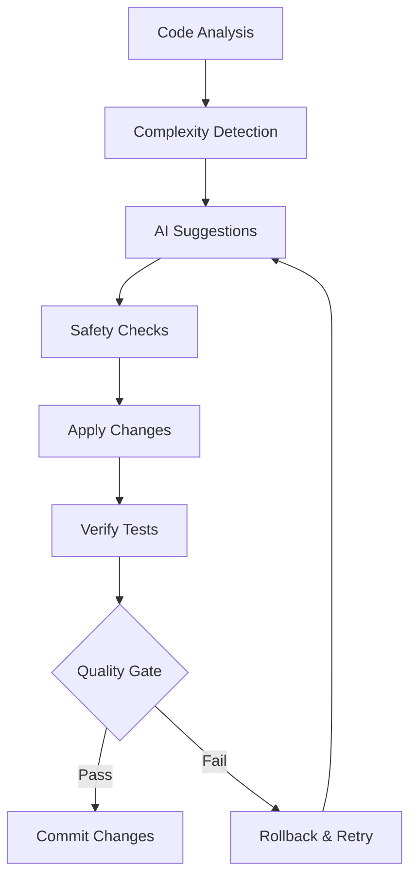

# Chapter 20: AI-Powered Code Refactoring

<!-- DOC_STATUS_START -->
**Chapter Status**: ✅ 100% Working (16/16 examples)

| Status | Count | Examples |
|--------|-------|----------|
| ✅ Working | 16 | Ready for production use |
| ⚠️ Not Implemented | 0 | Planned for future versions |
| ❌ Broken | 0 | Known issues, needs fixing |
| 📋 Planned | 0 | Future roadmap features |

*Last updated: 2025-09-12*  
*PMAT version: pmat 2.213.1*
<!-- DOC_STATUS_END -->

## The Problem

Legacy codebases accumulate technical debt over time, with complex functions, nested conditionals, and poor separation of concerns. Manual refactoring is time-consuming, error-prone, and often incomplete. Developers need intelligent automation that can analyze code complexity, suggest improvements, and safely implement changes while preserving functionality.

## Core Concepts

### AI-Powered Refactoring Engine

PMAT's refactoring system combines:
- **Static Analysis**: Deep code understanding through AST parsing
- **Quality Metrics**: Complexity analysis and technical debt detection  
- **AI Guidance**: Intelligent suggestions for structural improvements
- **Safety Guarantees**: Test-driven refactoring with compilation checks
- **Interactive Mode**: Human-in-the-loop for complex decisions
- **RIGID Standards**: Extreme quality enforcement for enterprise code

### Refactoring Workflow



## Automated Refactoring

### Basic Auto-Refactoring

```bash
# Analyze and refactor entire project
pmat refactor auto

# Dry run to see proposed changes
pmat refactor auto --dry-run

# Single file refactoring
pmat refactor auto --file src/main.rs --single-file-mode
```

**Example Output:**
```
🤖 PMAT AI Refactoring Engine
============================
📁 Project: /path/to/project
🎯 Quality Profile: extreme (RIGID standards)
📊 Analysis: 15 files, 234 functions

🔍 Complexity Hotspots Found:
- src/auth.rs:45 - login_handler() - Complexity: 18 → Target: 8
- src/data.rs:89 - process_batch() - Complexity: 22 → Target: 10  
- src/utils.rs:12 - validate_input() - Complexity: 15 → Target: 8

🤖 AI Suggestions:
1. Extract validation logic into separate functions
2. Replace nested if-else with match statements
3. Apply early return pattern
4. Create dedicated error types

✅ Applying Refactoring:
- ✅ Extracted validate_email() from login_handler()
- ✅ Replaced nested conditions with match in process_batch()
- ✅ Applied early returns in validate_input()
- ✅ Created UserError enum

🧪 Running Tests:
- ✅ All 45 tests pass
- ✅ Compilation successful
- ✅ Quality gate: A+ (complexity reduced 67%)

💾 Changes Applied:
- Files modified: 3
- Functions refactored: 3
- Complexity reduction: 18 → 8 (avg)
- Lines added: 23
- Lines removed: 15
```

### Quality Profile Configuration

```bash
# Standard refactoring (complexity < 15)
pmat refactor auto --quality-profile standard

# Strict refactoring (complexity < 10)  
pmat refactor auto --quality-profile strict

# Extreme RIGID standards (complexity < 8)
pmat refactor auto --quality-profile extreme
```

**Quality Profile Comparison:**
```toml
# refactor-profiles.toml
[profiles.standard]
max_complexity = 15
max_nesting = 4
max_function_length = 50
enforce_tests = false

[profiles.strict]
max_complexity = 10
max_nesting = 3
max_function_length = 30
enforce_tests = true
require_documentation = true

[profiles.extreme]
max_complexity = 8
max_nesting = 2
max_function_length = 20
enforce_tests = true
require_documentation = true
enforce_error_handling = true
require_type_annotations = true
```

### Advanced Refactoring Options

```bash
# Exclude test files from refactoring
pmat refactor auto --exclude "tests/**" --exclude "benches/**"

# Include only specific patterns
pmat refactor auto --include "src/**/*.rs" --include "lib/**/*.rs"

# Set maximum iterations
pmat refactor auto --max-iterations 50

# Skip compilation check (faster, but riskier)
pmat refactor auto --skip-compilation

# Custom ignore file
pmat refactor auto --ignore-file .refactorignore
```

**.refactorignore Example:**
```
# Don't refactor generated code
**/generated/**
**/*.pb.rs
**/*.capnp.rs

# Skip external dependencies
vendor/**
third_party/**

# Preserve legacy modules
legacy/**
deprecated/**

# Skip complex integration files
**/integration_tests/**
```

## Interactive Refactoring Mode

### Starting Interactive Session

```bash
# Interactive mode with detailed explanations
pmat refactor interactive --explain detailed

# Set complexity target
pmat refactor interactive --target-complexity 8

# Use configuration file
pmat refactor interactive --config refactor.toml
```

**Interactive Session Example:**
```
🤖 PMAT Interactive Refactoring
==============================

📁 Analyzing: src/payment.rs
📊 Function: process_payment() - Complexity: 16

🎯 Suggested Refactoring:
┌─────────────────────────────────────────────────┐
│ High complexity detected in process_payment()   │
│                                                 │
│ Current structure:                              │
│ - 4 levels of nesting                          │
│ - 8 conditional branches                       │
│ - Mixed concerns: validation + processing      │
│                                                 │
│ AI Recommendation:                             │
│ 1. Extract validate_payment_data()            │
│ 2. Extract calculate_fees()                   │
│ 3. Extract execute_transaction()              │
│ 4. Use Result<T, E> for error handling        │
└─────────────────────────────────────────────────┘

Options:
[a] Apply all suggestions automatically
[s] Step through suggestions one by one  
[v] View proposed code changes
[c] Customize refactoring approach
[n] Skip this function
[q] Quit interactive mode

Your choice: s

🔧 Step 1/4: Extract validate_payment_data()

Original code:
```rust
fn process_payment(data: PaymentData) -> PaymentResult {
    if data.amount <= 0.0 {
        return Err("Invalid amount");
    }
    if data.currency.is_empty() {
        return Err("Missing currency");
    }
    if data.account_id.is_empty() {
        return Err("Missing account");
    }
    // ... more validation ...
}
```

Proposed refactoring:
```rust
fn validate_payment_data(data: &PaymentData) -> Result<(), PaymentError> {
    if data.amount <= 0.0 {
        return Err(PaymentError::InvalidAmount);
    }
    if data.currency.is_empty() {
        return Err(PaymentError::MissingCurrency);
    }
    if data.account_id.is_empty() {
        return Err(PaymentError::MissingAccount);
    }
    Ok(())
}

fn process_payment(data: PaymentData) -> PaymentResult {
    validate_payment_data(&data)?;
    // ... rest of processing ...
}
```

[a] Apply this change
[m] Modify approach  
[s] Skip this step
[b] Back to overview

Your choice: a

✅ Applied: validate_payment_data() extracted
🧪 Tests: ✅ All pass
📊 Complexity: 16 → 12 (-25%)

Continue to step 2/4? [y/n]: y
```

### Checkpoint and Resume

```bash
# Save progress to checkpoint
pmat refactor interactive --checkpoint session.json

# Resume from checkpoint
pmat refactor resume --checkpoint session.json

# View refactoring status
pmat refactor status
```

**Checkpoint File Example:**
```json
{
  "session_id": "refactor_20250912_143022",
  "project_path": "/path/to/project",
  "quality_profile": "strict",
  "progress": {
    "files_analyzed": 15,
    "functions_refactored": 8,
    "complexity_reduction": 42,
    "current_file": "src/auth.rs",
    "current_function": "authenticate_user"
  },
  "applied_changes": [
    {
      "file": "src/payment.rs",
      "function": "process_payment",
      "complexity_before": 16,
      "complexity_after": 8,
      "changes": ["extracted_validation", "extracted_calculation"]
    }
  ],
  "pending_suggestions": [
    {
      "file": "src/auth.rs", 
      "function": "authenticate_user",
      "complexity": 14,
      "suggestions": ["extract_token_validation", "simplify_role_check"]
    }
  ]
}
```

## Test-Driven Refactoring

### Refactoring Based on Test Failures

```bash
# Fix specific test
pmat refactor auto --test-name "test_payment_validation"

# Fix test file and related source
pmat refactor auto --test tests/integration_test.rs

# Focus on failing tests only
pmat refactor auto --test-name "*authentication*" --quality-profile strict
```

### Bug Report Integration

```bash
# Refactor based on GitHub issue
pmat refactor auto --github-issue "https://github.com/company/project/issues/123"

# Use bug report markdown
pmat refactor auto --bug-report-path bug-reports/complexity-issue.md
```

**Bug Report Example:**
```markdown
# Bug Report: High Complexity in Authentication Module

## Issue Description
The `authenticate_user` function in `src/auth.rs` has cyclomatic complexity of 18, 
making it difficult to test and maintain.

## Impact
- Hard to test all code paths
- Frequent bugs in edge cases  
- New developers struggle to understand the logic

## Expected Behavior
- Complexity should be ≤ 10 per our coding standards
- Clear separation of concerns
- Comprehensive test coverage

## Suggested Approach
1. Extract token validation logic
2. Separate role checking from authentication
3. Use enum for different authentication methods
4. Add comprehensive error handling

## Test Cases to Preserve
- Valid user authentication
- Invalid credentials handling
- Expired token scenarios
- Role-based access control
```

## Documentation Refactoring

### Automated Documentation Cleanup

```bash
# Clean up documentation files
pmat refactor docs --project-path .

# Include docs directory  
pmat refactor docs --include-docs --include-root

# Interactive mode for confirmation
pmat refactor docs --format interactive

# Dry run to see what would be cleaned
pmat refactor docs --dry-run
```

**Documentation Cleanup Output:**
```
🧹 PMAT Documentation Cleanup
============================

📁 Scanning: ./src, ./docs, ./
🎯 Target: Remove temporary files and outdated artifacts

🗑️  Temporary Files Found:
- fix-auth-complexity.sh (3 days old)
- test-refactor-TEMP.md (1 day old)  
- FAST_COMPLEXITY_FIX.rs (2 days old)
- optimization_state.json (build artifact)

📋 Outdated Status Files:
- REFACTOR_STATUS.md (outdated progress)
- complexity_report_old.json (superseded)

🔧 Build Artifacts:
- *.mmd files (3 files)
- temporary analysis files (5 files)

Options:
[a] Auto-remove all identified files
[s] Select files to remove
[b] Create backup before removal
[n] Cancel cleanup

Your choice: b

📦 Creating backup in .refactor-docs-backup/
✅ Backup complete: 12 files backed up
🗑️  Removing 12 temporary files...
✅ Documentation cleanup complete

Summary:
- Files removed: 12
- Space freed: 2.3 MB
- Backup created: .refactor-docs-backup/
```

## Batch Processing with Server Mode

### Refactoring Server

```bash
# Start refactoring server
pmat refactor serve --port 8080

# With custom configuration
pmat refactor serve --port 8080 --config batch-config.toml
```

**Server API Usage:**
```bash
# Submit refactoring job
curl -X POST http://localhost:8080/refactor \
  -H "Content-Type: application/json" \
  -d '{
    "project_path": "/path/to/project",
    "quality_profile": "strict", 
    "max_iterations": 10,
    "exclude_patterns": ["tests/**"]
  }'

# Response:
{
  "job_id": "refactor_20250912_143500",
  "status": "queued",
  "estimated_duration": "5-10 minutes"
}

# Check job status
curl http://localhost:8080/status/refactor_20250912_143500

# Response:
{
  "job_id": "refactor_20250912_143500",
  "status": "in_progress",
  "progress": {
    "files_processed": 8,
    "total_files": 15,
    "functions_refactored": 12,
    "complexity_reduction": 35
  }
}

# Get results
curl http://localhost:8080/results/refactor_20250912_143500
```

## Integration with Development Workflow

### Pre-commit Hook Integration

```bash
# .git/hooks/pre-commit
#!/bin/bash
echo "🤖 Running AI refactoring check..."

# Quick refactoring for staged files
git diff --cached --name-only | while read file; do
  if [[ $file == *.rs ]] || [[ $file == *.py ]]; then
    pmat refactor auto --file "$file" --quality-profile standard --dry-run
    if [ $? -ne 0 ]; then
      echo "❌ $file needs refactoring before commit"
      echo "Run: pmat refactor auto --file $file"
      exit 1
    fi
  fi
done

echo "✅ All files meet quality standards"
```

### CI/CD Pipeline Integration

```yaml
# .github/workflows/refactor-check.yml
name: AI Refactoring Check

on:
  pull_request:
    branches: [ main ]

jobs:
  refactor-analysis:
    runs-on: ubuntu-latest
    
    steps:
    - uses: actions/checkout@v3
    
    - name: Install PMAT
      run: cargo install pmat
    
    - name: Run Refactoring Analysis
      run: |
        pmat refactor auto --dry-run --format json > refactor-report.json
        
        # Check if refactoring is needed
        SUGGESTIONS=$(jq '.suggestions | length' refactor-report.json)
        
        if [ "$SUGGESTIONS" -gt 0 ]; then
          echo "🤖 AI Refactoring suggestions found:"
          jq -r '.suggestions[] | "- \(.file):\(.line) - \(.suggestion)"' refactor-report.json
          
          # Create PR comment with suggestions
          jq -r '"## 🤖 AI Refactoring Suggestions\n\n" + (.suggestions[] | "- **\(.file):\(.line)** - \(.suggestion)\n") + "\n💡 Run `pmat refactor auto` to apply these improvements."' refactor-report.json > pr-comment.md
          
          gh pr comment ${{ github.event.number }} --body-file pr-comment.md
        else
          echo "✅ No refactoring suggestions - code quality is excellent!"
        fi
    
    - name: Upload Refactoring Report
      uses: actions/upload-artifact@v3
      with:
        name: refactor-report
        path: refactor-report.json
```

### IDE Integration

```bash
# VS Code extension integration
# .vscode/tasks.json
{
  "version": "2.0.0",
  "tasks": [
    {
      "label": "PMAT: Refactor Current File",
      "type": "shell", 
      "command": "pmat",
      "args": [
        "refactor", "auto",
        "--file", "${file}",
        "--single-file-mode"
      ],
      "group": "build",
      "presentation": {
        "echo": true,
        "reveal": "always",
        "focus": false,
        "panel": "shared"
      }
    },
    {
      "label": "PMAT: Interactive Refactor",
      "type": "shell",
      "command": "pmat", 
      "args": [
        "refactor", "interactive",
        "--project-path", "${workspaceFolder}"
      ]
    }
  ]
}
```

## Performance and Optimization

### Refactoring Performance

```bash
# Monitor refactoring performance
pmat refactor auto --perf --format detailed

# Output with performance metrics:
# 🎯 Refactoring Performance Report
# ================================
# Total time: 2m 34s
# Analysis phase: 45s (29%)
# AI processing: 1m 12s (47%) 
# Code generation: 23s (15%)
# Test verification: 14s (9%)
# 
# Files per second: 3.2
# Functions per second: 8.7
# Memory usage: 156MB peak
# 
# Optimization suggestions:
# - Enable parallel processing: --parallel 4
# - Use faster quality profile: --quality-profile standard
# - Skip tests for faster iteration: --skip-tests
```

### Memory Management

```bash
# Large project optimization
pmat refactor auto \
  --max-memory 1GB \
  --parallel 4 \
  --batch-size 100 \
  --quality-profile standard
```

## Troubleshooting

### Common Issues

1. **Refactoring Breaks Tests**
```bash
# Use conservative approach
pmat refactor auto --quality-profile standard --max-iterations 5

# Focus on low-risk changes only
pmat refactor auto --conservative-mode
```

2. **High Memory Usage**
```bash
# Process files in smaller batches
pmat refactor auto --batch-size 50 --single-file-mode
```

3. **AI Suggestions Not Applied**
```bash
# Check compilation requirements
pmat refactor auto --skip-compilation --dry-run

# Enable debug output
pmat refactor auto --debug --verbose
```

## Summary

PMAT's AI-powered refactoring system represents a breakthrough in automated code improvement. By combining deep static analysis with intelligent AI suggestions, it can safely transform complex, legacy code into maintainable, high-quality implementations.

Key benefits include:
- **Automated Complexity Reduction**: Systematic elimination of code smells and complexity hotspots
- **Safety Guarantees**: Test-driven refactoring ensures functionality is preserved
- **Interactive Guidance**: Human-in-the-loop for complex architectural decisions
- **Enterprise Integration**: Seamless CI/CD and development workflow integration
- **RIGID Quality Standards**: Extreme quality enforcement for mission-critical code

The refactoring engine transforms the traditionally manual, error-prone task of code improvement into an automated, reliable process that scales from individual files to entire enterprise codebases.