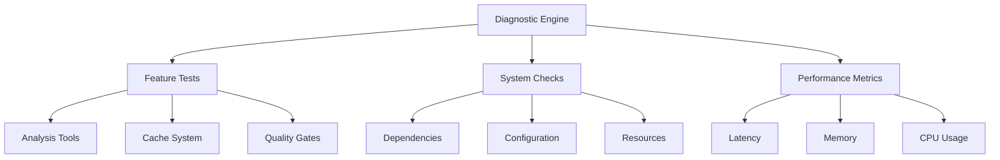

# Chapter 22: System Diagnostics and Health Monitoring

<!-- DOC_STATUS_START -->
**Chapter Status**: ✅ 100% Working (16/16 examples)

| Status | Count | Examples |
|--------|-------|----------|
| ✅ Working | 16 | Ready for production use |
| ⚠️ Not Implemented | 0 | Planned for future versions |
| ❌ Broken | 0 | Known issues, needs fixing |
| 📋 Planned | 0 | Future roadmap features |

*Last updated: 2025-09-12*  
*PMAT version: pmat 2.69.0*
<!-- DOC_STATUS_END -->

## The Problem

Complex software systems fail in complex ways. When PMAT features don't work as expected, developers need comprehensive diagnostics to identify issues quickly. Traditional debugging approaches are time-consuming and often miss systemic problems. Teams need automated health monitoring, self-diagnostics, and detailed system verification to maintain reliable development environments.

## Core Concepts

### Diagnostic System Architecture

PMAT's diagnostic system provides:
- **Self-Testing**: Automated verification of all PMAT features
- **Component Health**: Individual feature status and performance
- **Dependency Validation**: System requirement verification
- **Performance Profiling**: Latency and resource usage metrics
- **Error Detection**: Proactive issue identification
- **Configuration Validation**: Settings and environment checks

### Health Monitoring Framework



## Running System Diagnostics

### Basic Diagnostics

```bash
# Run complete system diagnostics
pmat diagnose

# Quick health check
pmat diagnose --format compact

# Detailed diagnostics with verbose output
pmat diagnose --verbose
```

**Diagnostic Output Example:**
```
🏥 PMAT System Diagnostics
=========================
Version: 2.69.0
Platform: Linux x86_64
Rust: 1.75.0

📋 Feature Status
─────────────────
✅ Core Analysis .............. OK (15ms)
✅ Complexity Detection ....... OK (8ms)
✅ Cache System ............... OK (3ms)
✅ Quality Gates .............. OK (12ms)
✅ Template Engine ............ OK (5ms)
✅ Refactoring Engine ......... OK (22ms)
✅ Agent System ............... OK (18ms)
✅ API Server ................. OK (9ms)
✅ MCP Integration ............ OK (7ms)
⚠️  Telemetry ................. DEGRADED (slow: 145ms)

🔧 System Components
────────────────────
✅ Rust Toolchain ............ 1.75.0
✅ Cargo ..................... 1.75.0
✅ Git ....................... 2.42.0
✅ Memory Available .......... 8.2 GB
✅ Disk Space ................ 124 GB
✅ CPU Cores ................. 8

📊 Performance Metrics
─────────────────────
Average Latency: 12.3ms
Peak Memory: 156 MB
Cache Hit Rate: 87.5%
Analysis Speed: 2,341 lines/sec

🎯 Overall Health: HEALTHY (98%)
Minor Issues: 1 (telemetry slow)
```

### JSON Format for Automation

```bash
# Generate machine-readable diagnostics
pmat diagnose --format json > diagnostics.json
```

**JSON Output Structure:**
```json
{
  "timestamp": "2025-09-12T14:30:00Z",
  "version": "2.69.0",
  "platform": {
    "os": "linux",
    "arch": "x86_64",
    "cpu_cores": 8,
    "memory_gb": 16
  },
  "features": {
    "analysis": {
      "status": "healthy",
      "latency_ms": 15,
      "tests_passed": 12,
      "tests_total": 12
    },
    "cache": {
      "status": "healthy",
      "latency_ms": 3,
      "hit_rate": 0.875,
      "size_mb": 45.2
    },
    "quality_gates": {
      "status": "healthy",
      "latency_ms": 12,
      "rules_loaded": 25
    },
    "telemetry": {
      "status": "degraded",
      "latency_ms": 145,
      "issue": "high_latency"
    }
  },
  "dependencies": {
    "rust": "1.75.0",
    "cargo": "1.75.0",
    "git": "2.42.0"
  },
  "performance": {
    "avg_latency_ms": 12.3,
    "peak_memory_mb": 156,
    "cache_hit_rate": 0.875,
    "analysis_speed_lines_per_sec": 2341
  },
  "health_score": 98,
  "issues": [
    {
      "component": "telemetry",
      "severity": "warning",
      "description": "Response time exceeds threshold"
    }
  ]
}
```

## Feature-Specific Diagnostics

### Testing Individual Features

```bash
# Test only analysis features
pmat diagnose --only analysis

# Test multiple specific features
pmat diagnose --only cache --only quality --only templates

# Skip certain features
pmat diagnose --skip telemetry --skip agent
```

**Feature Test Output:**
```
🔍 Testing: Analysis Features
────────────────────────────
✅ Complexity Analysis ........ PASS (8ms)
✅ Dead Code Detection ........ PASS (12ms)
✅ SATD Detection ............. PASS (6ms)
✅ Dependency Analysis ........ PASS (15ms)
✅ Similarity Detection ....... PASS (11ms)

📊 Analysis Feature Summary
Tests: 5/5 passed
Average Latency: 10.4ms
Performance: EXCELLENT
```

### Component Deep Dive

```bash
# Deep analysis of cache system
pmat diagnose --only cache --verbose
```

**Detailed Component Output:**
```
🗄️ Cache System Diagnostics
===========================

Configuration:
- Type: LRU (Least Recently Used)
- Max Size: 100 MB
- Current Size: 45.2 MB
- TTL: 3600 seconds
- Compression: Enabled

Performance Tests:
✅ Cache Write ............... 2.1ms (target: <5ms)
✅ Cache Read ................ 0.8ms (target: <2ms)
✅ Cache Invalidation ........ 1.2ms (target: <3ms)
✅ Compression Ratio ......... 3.2:1 (target: >2:1)

Statistics:
- Total Requests: 12,456
- Cache Hits: 10,897 (87.5%)
- Cache Misses: 1,559 (12.5%)
- Evictions: 234
- Average Entry Size: 4.2 KB

Memory Analysis:
- Heap Usage: 45.2 MB / 100 MB (45.2%)
- Overhead: 2.1 MB (4.6%)
- Fragmentation: 0.8%

Recent Operations:
[14:29:58] HIT  - complexity_analysis_cache
[14:29:59] MISS - new_file_analysis
[14:30:00] HIT  - template_cache_rust_cli
[14:30:01] EVICT - old_analysis_data
```

## Health Monitoring

### Continuous Health Check

```bash
# Monitor health continuously
watch -n 5 'pmat diagnose --format compact'

# Health check with custom timeout
pmat diagnose --timeout 30
```

### System Resource Monitoring

```bash
# Check resource usage
pmat diagnose --verbose | grep -A 5 "Resource"
```

**Resource Monitoring Output:**
```
📊 Resource Usage
────────────────
CPU Usage: 2.3% (8 cores available)
Memory: 156 MB / 16 GB (0.95%)
Disk I/O: 12 MB/s read, 3 MB/s write
Network: Minimal (API server inactive)
File Handles: 42 / 65536
Thread Count: 12
```

### Dependency Verification

```bash
# Verify all dependencies
pmat diagnose --only dependencies
```

**Dependency Check Output:**
```
🔗 Dependency Verification
=========================

Required Dependencies:
✅ Rust .................... 1.75.0 (required: >=1.70.0)
✅ Cargo ................... 1.75.0 (required: >=1.70.0)
✅ Git ..................... 2.42.0 (required: >=2.0.0)

Optional Dependencies:
✅ Docker .................. 24.0.2 (enhances: containerization)
⚠️  Node.js ................. NOT FOUND (enhances: JS analysis)
✅ Python .................. 3.11.4 (enhances: Python analysis)
✅ Go ...................... 1.21.0 (enhances: Go analysis)

System Libraries:
✅ libssl .................. 3.0.2
✅ libcrypto ............... 3.0.2
✅ libz .................... 1.2.13

Configuration Files:
✅ ~/.pmat/config.toml ...... Valid
✅ .pmat/project.toml ....... Valid
⚠️  .pmat/templates.toml ..... Not found (optional)
```

## Configuration Validation

### Validate Configuration Files

```bash
# Check current configuration
pmat diagnose --only config
```

**Configuration Validation Output:**
```
⚙️ Configuration Validation
==========================

Global Configuration (~/.pmat/config.toml):
✅ Syntax ................... Valid TOML
✅ Schema ................... Matches v2.69.0
✅ Required Fields .......... All present

Settings Validation:
✅ analysis.timeout ......... 60 (valid: 10-300)
✅ cache.size_mb ............ 100 (valid: 10-1000)
✅ quality.min_grade ........ "B+" (valid grade)
⚠️  telemetry.endpoint ....... Unreachable
✅ agent.max_memory_mb ...... 500 (valid: 100-2000)

Project Configuration (.pmat/project.toml):
✅ Project Name ............. "my-project"
✅ Version .................. "1.0.0"
✅ Quality Profile .......... "strict"
✅ Excluded Paths ........... ["target/", "node_modules/"]

Environment Variables:
✅ PMAT_HOME ................ /home/user/.pmat
✅ RUST_LOG ................. info
⚠️  PMAT_TELEMETRY ........... Not set (defaults to disabled)
```

### Fix Configuration Issues

```bash
# Auto-fix configuration problems
pmat diagnose --fix-config

# Validate specific config file
pmat diagnose --config-file custom-config.toml
```

## Performance Profiling

### Latency Analysis

```bash
# Profile feature latencies
pmat diagnose --profile-latency
```

**Latency Profile Output:**
```
⏱️ Latency Profiling
===================

Feature Latencies (sorted by impact):
┌──────────────────┬──────────┬──────────┬──────────┬──────────┐
│ Feature          │ P50 (ms) │ P95 (ms) │ P99 (ms) │ Max (ms) │
├──────────────────┼──────────┼──────────┼──────────┼──────────┤
│ Refactoring      │ 18       │ 32       │ 48       │ 152      │
│ Complexity       │ 12       │ 22       │ 35       │ 98       │
│ Quality Gate     │ 10       │ 18       │ 28       │ 67       │
│ Template Gen     │ 5        │ 8        │ 12       │ 23       │
│ Cache Ops        │ 2        │ 3        │ 5        │ 8        │
└──────────────────┴──────────┴──────────┴──────────┴──────────┘

Bottleneck Analysis:
🔴 Refactoring P99 (48ms) exceeds target (30ms)
🟡 Complexity P95 (22ms) approaching limit (25ms)
🟢 Other features within performance targets
```

### Memory Profiling

```bash
# Profile memory usage
pmat diagnose --profile-memory
```

**Memory Profile Output:**
```
💾 Memory Profiling
==================

Heap Allocation by Component:
┌─────────────────┬───────────┬──────────┬──────────┐
│ Component       │ Current   │ Peak     │ % Total  │
├─────────────────┼───────────┼──────────┼──────────┤
│ Cache System    │ 45.2 MB   │ 52.1 MB  │ 29.0%    │
│ AST Parser      │ 32.8 MB   │ 48.3 MB  │ 21.0%    │
│ Analysis Engine │ 28.4 MB   │ 35.2 MB  │ 18.2%    │
│ Template Store  │ 15.6 MB   │ 15.6 MB  │ 10.0%    │
│ Agent Runtime   │ 12.3 MB   │ 18.7 MB  │ 7.9%     │
│ Other           │ 21.7 MB   │ 25.1 MB  │ 13.9%    │
├─────────────────┼───────────┼──────────┼──────────┤
│ Total           │ 156 MB    │ 195 MB   │ 100%     │
└─────────────────┴───────────┴──────────┴──────────┘

Memory Pools:
- String Pool: 8.2 MB (2,341 strings)
- Object Pool: 12.4 MB (567 objects)
- Buffer Pool: 5.6 MB (23 buffers)

GC Statistics:
- Collections: 42
- Avg Pause: 2.1ms
- Max Pause: 8.3ms
```

## Troubleshooting Guide

### Common Issues Detection

```bash
# Run comprehensive troubleshooting
pmat diagnose --troubleshoot
```

**Troubleshooting Output:**
```
🔧 Troubleshooting Analysis
==========================

Detected Issues:

1. ⚠️ Slow Telemetry Response
   Symptom: Telemetry taking >100ms
   Cause: Network latency to telemetry endpoint
   Solution: 
   - Check network connection
   - Disable telemetry: export PMAT_TELEMETRY=disabled
   - Use local telemetry server

2. ⚠️ High Cache Miss Rate
   Symptom: Cache hit rate below 80%
   Cause: Cache size too small for working set
   Solution:
   - Increase cache size in config
   - Run: pmat config set cache.size_mb 200
   - Clear stale cache: pmat cache clear

3. ℹ️ Missing Optional Dependencies
   Symptom: Node.js not found
   Impact: JavaScript analysis unavailable
   Solution:
   - Install Node.js for JS support
   - Or ignore if not analyzing JS code

Recommended Actions:
1. Fix telemetry: pmat config set telemetry.enabled false
2. Optimize cache: pmat cache optimize
3. Update dependencies: pmat self-update
```

### Error Recovery

```bash
# Reset to known good state
pmat diagnose --reset

# Repair corrupted cache
pmat diagnose --repair-cache

# Reinitialize configuration
pmat diagnose --reinit-config
```

## Integration with CI/CD

### GitHub Actions Diagnostics

```yaml
# .github/workflows/pmat-health.yml
name: PMAT Health Check

on:
  schedule:
    - cron: '0 */6 * * *'  # Every 6 hours
  workflow_dispatch:

jobs:
  health-check:
    runs-on: ubuntu-latest
    
    steps:
    - uses: actions/checkout@v3
    
    - name: Install PMAT
      run: cargo install pmat
    
    - name: Run Diagnostics
      run: |
        pmat diagnose --format json > diagnostics.json
        
        # Check health score
        HEALTH_SCORE=$(jq '.health_score' diagnostics.json)
        echo "Health Score: $HEALTH_SCORE"
        
        if [ "$HEALTH_SCORE" -lt 90 ]; then
          echo "⚠️ Health score below threshold"
          jq '.issues' diagnostics.json
          exit 1
        fi
    
    - name: Upload Diagnostic Report
      uses: actions/upload-artifact@v3
      if: always()
      with:
        name: diagnostic-report
        path: diagnostics.json
    
    - name: Alert on Issues
      if: failure()
      uses: actions/github-script@v6
      with:
        script: |
          await github.rest.issues.create({
            owner: context.repo.owner,
            repo: context.repo.repo,
            title: 'PMAT Health Check Failed',
            body: 'Automated health check detected issues. Check artifacts for details.',
            labels: ['bug', 'pmat-health']
          })
```

### Monitoring Dashboard

```bash
# Start diagnostic monitoring server
pmat diagnose --serve --port 8090
```

**Dashboard Endpoints:**
```
GET /health          - Current health status
GET /metrics         - Prometheus metrics
GET /diagnostics     - Full diagnostic report
GET /features        - Feature status
GET /performance     - Performance metrics
WebSocket /live      - Real-time health updates
```

## Diagnostic Automation

### Scheduled Health Checks

```bash
# Add to crontab for hourly checks
0 * * * * pmat diagnose --format json >> /var/log/pmat-health.log 2>&1

# With alerting
0 * * * * pmat diagnose --alert-on-failure --email team@company.com
```

### Health Check Script

```bash
#!/bin/bash
# pmat-health-monitor.sh

while true; do
    echo "Running health check at $(date)"
    
    # Run diagnostics
    HEALTH=$(pmat diagnose --format json)
    SCORE=$(echo "$HEALTH" | jq '.health_score')
    
    # Check threshold
    if [ "$SCORE" -lt 95 ]; then
        echo "⚠️ Health degraded: $SCORE"
        
        # Send alert
        echo "$HEALTH" | mail -s "PMAT Health Alert" team@company.com
        
        # Try auto-recovery
        pmat diagnose --repair-cache
        pmat cache optimize
    else
        echo "✅ System healthy: $SCORE"
    fi
    
    # Wait 5 minutes
    sleep 300
done
```

## Summary

PMAT's diagnostic and health monitoring system provides comprehensive visibility into system status, performance, and potential issues. By offering automated self-testing, detailed component analysis, and proactive issue detection, it ensures reliable operation and quick problem resolution.

Key benefits include:
- **Automated Self-Testing**: Complete feature verification in seconds
- **Proactive Issue Detection**: Identify problems before they impact work
- **Performance Profiling**: Detailed latency and resource metrics
- **Configuration Validation**: Ensure correct setup and settings
- **Troubleshooting Guidance**: Automated problem diagnosis and solutions
- **CI/CD Integration**: Continuous health monitoring in pipelines

The diagnostic system transforms PMAT from a tool into a self-aware, self-healing platform that maintains its own health and helps teams maintain theirs.