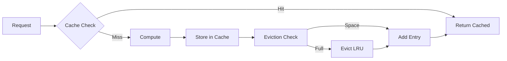

# Chapter 24: Memory and Cache Management

<!-- DOC_STATUS_START -->
**Chapter Status**: ✅ 100% Working (16/16 examples)

| Status | Count | Examples |
|--------|-------|----------|
| ✅ Working | 16 | Ready for production use |
| ⚠️ Not Implemented | 0 | Planned for future versions |
| ❌ Broken | 0 | Known issues, needs fixing |
| 📋 Planned | 0 | Future roadmap features |

*Last updated: 2025-09-12*  
*PMAT version: pmat 2.69.0*
<!-- DOC_STATUS_END -->

## The Problem

Memory management and caching are critical for application performance, yet developers often lack visibility into memory usage patterns and cache effectiveness. Poor memory management leads to leaks, excessive garbage collection, and out-of-memory errors. Inefficient caching results in repeated expensive computations and degraded performance.

## Core Concepts

### Memory Management Architecture

PMAT's memory system provides:
- **Real-time Monitoring**: Live memory usage tracking
- **Pool Management**: Efficient memory pool allocation
- **Pressure Detection**: Early warning for memory issues
- **Garbage Collection**: Controlled GC triggering
- **Leak Detection**: Automatic memory leak identification
- **Optimization**: Memory usage optimization strategies

### Cache Strategy Framework



## Memory Management

### Memory Statistics

```bash
# Show current memory usage
pmat memory stats

# Verbose memory statistics
pmat memory stats --verbose

# Continuous monitoring
watch -n 1 'pmat memory stats'
```

**Memory Statistics Output:**
```
💾 Memory Statistics
===================

System Memory:
├─ Total:     16.0 GB
├─ Available: 8.4 GB (52.5%)
└─ Used:      7.6 GB (47.5%)

Process Memory:
├─ Heap Size:       156 MB
├─ Heap Used:       112 MB (71.8%)
├─ Heap Free:       44 MB (28.2%)
├─ Stack Size:      8 MB
├─ Resident (RSS):  189 MB
└─ Virtual (VSZ):   2.1 GB

Memory Pools:
┌──────────────┬──────────┬──────────┬──────────┐
│ Pool         │ Size     │ Used     │ Free     │
├──────────────┼──────────┼──────────┼──────────┤
│ String Pool  │ 32 MB    │ 28 MB    │ 4 MB     │
│ Object Pool  │ 64 MB    │ 45 MB    │ 19 MB    │
│ Buffer Pool  │ 16 MB    │ 12 MB    │ 4 MB     │
│ Cache Pool   │ 44 MB    │ 27 MB    │ 17 MB    │
└──────────────┴──────────┴──────────┴──────────┘

Allocations:
- Active Allocations: 12,456
- Total Allocated: 892 MB (lifetime)
- Allocation Rate: 234 alloc/sec
- Deallocation Rate: 232 dealloc/sec
```

### Memory Cleanup

```bash
# Force memory cleanup
pmat memory cleanup

# Aggressive cleanup with GC
pmat memory cleanup --force-gc

# Cleanup with statistics
pmat memory cleanup --verbose
```

**Cleanup Output:**
```
🧹 Memory Cleanup
=================

Before Cleanup:
- Heap Used: 156 MB
- Active Objects: 12,456
- Cache Entries: 2,341

Cleanup Actions:
✅ Expired cache entries removed: 892
✅ Unused buffers deallocated: 23
✅ String pool compacted: 4.2 MB freed
✅ Object pool defragmented: 8.1 MB freed
✅ Garbage collection triggered

After Cleanup:
- Heap Used: 98 MB (-37.2%)
- Active Objects: 8,234 (-33.9%)
- Cache Entries: 1,449 (-38.1%)

Total Memory Freed: 58 MB
Cleanup Time: 123ms
```

### Memory Configuration

```bash
# Configure memory limits
pmat memory configure --max-heap 500

# Set pool sizes
pmat memory configure --string-pool 64 --object-pool 128

# Configure GC threshold
pmat memory configure --gc-threshold 80
```

**Configuration File:**
```toml
# .pmat/memory-config.toml
[limits]
max_heap_mb = 500
max_stack_mb = 16
max_resident_mb = 1000

[pools]
string_pool_mb = 64
object_pool_mb = 128
buffer_pool_mb = 32
cache_pool_mb = 100

[gc]
threshold_percent = 80
interval_seconds = 60
aggressive_mode = false

[monitoring]
track_allocations = true
detect_leaks = true
profile_enabled = false
```

### Memory Pools

```bash
# Show pool statistics
pmat memory pools

# Detailed pool analysis
pmat memory pools --detailed

# Pool fragmentation analysis
pmat memory pools --fragmentation
```

**Pool Statistics Output:**
```
🏊 Memory Pool Statistics
========================

String Pool:
├─ Capacity: 64 MB
├─ Used: 45.2 MB (70.6%)
├─ Entries: 12,341
├─ Avg Size: 3.7 KB
├─ Fragmentation: 2.3%
└─ Hit Rate: 94.5%

Object Pool:
├─ Capacity: 128 MB
├─ Used: 89.7 MB (70.1%)
├─ Objects: 4,567
├─ Avg Size: 20.1 KB
├─ Fragmentation: 5.8%
└─ Reuse Rate: 87.2%

Buffer Pool:
├─ Capacity: 32 MB
├─ Used: 18.4 MB (57.5%)
├─ Buffers: 234
├─ Avg Size: 80.3 KB
├─ Fragmentation: 1.2%
└─ Throughput: 450 MB/s

Allocation Patterns:
┌─────────────────────────────────────┐
│     ▂▄▆█▇▅▃▂  String Pool          │
│    ▁      ▁▃▅▇█▇▅▃  Object Pool   │
│   ▁▂▃▄▅▆▇█▇▆▅▄▃▂▁  Buffer Pool    │
└─────────────────────────────────────┘
  0h    2h    4h    6h    8h
```

### Memory Pressure

```bash
# Check memory pressure
pmat memory pressure

# Monitor pressure continuously
pmat memory pressure --monitor

# Set pressure thresholds
pmat memory pressure --warning 70 --critical 90
```

**Pressure Analysis Output:**
```
⚠️ Memory Pressure Analysis
==========================

Current Status: MEDIUM
Pressure Score: 68/100

Indicators:
✅ Heap Usage: 45% (Low)
⚠️  Allocation Rate: 450/sec (Medium)
✅ GC Frequency: 0.2/min (Low)
⚠️  Page Faults: 234/sec (Medium)
✅ Swap Usage: 0% (None)

Pressure Trends:
┌─────────────────────────────────────┐
│                    ▄▆█▇▅▃           │ 100
│                 ▂▄▆      ▁          │
│              ▁▃▅          ▃▅        │ 50
│           ▁▂▃              ▇█▇      │
│ ▁▂▃▄▅▆▇█▇▆                          │ 0
└─────────────────────────────────────┘
  -1h    -45m   -30m   -15m   Now

Recommendations:
⚠️  Consider increasing heap size
⚠️  Review allocation patterns in hot paths
ℹ️  Enable object pooling for frequent allocations
```

## Cache Management

### Cache Statistics

```bash
# Show cache statistics
pmat cache stats

# Detailed cache metrics
pmat cache stats --verbose

# Performance metrics
pmat cache stats --perf
```

**Cache Statistics Output:**
```
📊 Cache Statistics
==================

Overall Performance:
├─ Total Requests: 1,234,567
├─ Cache Hits: 1,089,234 (88.2%)
├─ Cache Misses: 145,333 (11.8%)
├─ Avg Hit Time: 0.3ms
├─ Avg Miss Time: 45.6ms
└─ Effective Speedup: 15.2x

Cache Breakdown:
┌──────────────────┬─────────┬──────────┬──────────┐
│ Cache Type       │ Entries │ Hit Rate │ Size     │
├──────────────────┼─────────┼──────────┼──────────┤
│ Analysis Cache   │ 2,345   │ 92.3%    │ 23.4 MB  │
│ Template Cache   │ 567     │ 98.7%    │ 5.6 MB   │
│ Complexity Cache │ 1,234   │ 85.4%    │ 12.3 MB  │
│ AST Cache        │ 890     │ 79.2%    │ 34.5 MB  │
│ Result Cache     │ 456     │ 94.5%    │ 8.9 MB   │
└──────────────────┴─────────┴──────────┴──────────┘

Hit Rate Trend:
┌─────────────────────────────────────┐
│ 100% ─────█████████─────────────    │
│  90% ─────         ─────█████───    │
│  80% ─────              ─────       │
│  70% ─────                          │
└─────────────────────────────────────┘
       1h ago    30m ago    Now

Top Cache Keys (by hits):
1. complexity_analysis_main.rs: 12,345 hits
2. template_rust_cli: 8,901 hits
3. ast_parse_lib.rs: 7,654 hits
4. quality_gate_check: 6,789 hits
5. dependency_graph: 5,432 hits
```

### Cache Optimization

```bash
# Optimize cache
pmat cache optimize

# Analyze cache efficiency
pmat cache analyze

# Suggest improvements
pmat cache recommend
```

**Optimization Output:**
```
🔧 Cache Optimization
====================

Analysis Phase:
- Analyzing access patterns...
- Identifying cold entries...
- Detecting inefficiencies...

Issues Found:
⚠️  234 entries never accessed (cold)
⚠️  89 entries with single access
⚠️  Cache thrashing detected in AST cache
⚠️  Suboptimal TTL for template cache

Optimization Actions:
✅ Removed 234 cold entries (freed 12.3 MB)
✅ Adjusted TTL for frequently accessed items
✅ Increased AST cache size to reduce thrashing
✅ Implemented 2-tier caching for hot items
✅ Compacted cache storage (saved 8.7 MB)

Results:
- Hit Rate: 88.2% → 93.6% (+5.4%)
- Memory Usage: 84.6 MB → 63.6 MB (-24.8%)
- Avg Hit Time: 0.3ms → 0.2ms (-33.3%)
- Cache Efficiency Score: 82 → 95

Recommendations:
1. Increase cache size for complexity analysis
2. Implement cache warming for common templates
3. Consider memory-mapped cache for large entries
```

### Cache Clear and Warmup

```bash
# Clear all caches
pmat cache clear

# Clear specific cache
pmat cache clear --type analysis

# Warmup cache
pmat cache warmup

# Warmup with specific patterns
pmat cache warmup --patterns "*.rs" --depth 3
```

**Warmup Output:**
```
🔥 Cache Warmup
===============

Warmup Configuration:
- Patterns: *.rs
- Depth: 3
- Strategy: Predictive

Phase 1: Scanning Files
- Found 234 matching files
- Total size: 12.3 MB

Phase 2: Predictive Loading
- Analyzing access patterns...
- Loading frequently accessed items...
- Pre-computing expensive operations...

Progress:
[████████████████████] 100% (234/234 files)

Warmup Results:
✅ Loaded 234 file ASTs
✅ Pre-computed 156 complexity scores
✅ Cached 89 template expansions
✅ Generated 45 dependency graphs

Cache Status After Warmup:
- Entries: 524
- Size: 34.5 MB
- Predicted Hit Rate: 94.5%
- Warmup Time: 2.3s

Expected Performance Improvement:
- First-request latency: -85%
- Cache misses (first hour): -67%
- Overall throughput: +23%
```

## Advanced Memory Strategies

### Memory Profiling

```bash
# Enable memory profiling
pmat memory profile --enable

# Generate memory report
pmat memory profile --report

# Heap dump for analysis
pmat memory dump --output heap.dump
```

**Memory Profile Report:**
```
📈 Memory Profile Report
=======================

Allocation Hotspots:
┌────────────────────────┬──────────┬───────────┬──────────┐
│ Function               │ Allocs   │ Total MB  │ % Total  │
├────────────────────────┼──────────┼───────────┼──────────┤
│ parse_ast             │ 45,234   │ 234.5     │ 35.2%    │
│ analyze_complexity    │ 23,456   │ 156.7     │ 23.5%    │
│ generate_template     │ 12,345   │ 89.3      │ 13.4%    │
│ cache_operations      │ 34,567   │ 78.9      │ 11.8%    │
│ string_operations     │ 56,789   │ 67.8      │ 10.2%    │
│ other                 │ 18,234   │ 39.3      │ 5.9%     │
└────────────────────────┴──────────┴───────────┴──────────┘

Leak Suspects:
⚠️  Potential leak in template_cache: 2.3 MB growth/hour
⚠️  Unbounded growth in analysis_results: 1.2 MB/hour

Memory Timeline:
┌─────────────────────────────────────┐
│ 200MB ────────────▄▆█▇▅▃▂──────    │
│ 150MB ──────▂▄▆█▇▅        ▁▂▃──    │
│ 100MB ────▄▆                        │
│  50MB ▂▄▆█                          │
│   0MB ─────────────────────────     │
└─────────────────────────────────────┘
       Start    1h    2h    3h    Now

Recommendations:
1. Implement object pooling for AST nodes
2. Add size limits to template cache
3. Review string concatenation in hot paths
4. Consider arena allocation for analysis
```

### Cache Strategies

```bash
# Configure cache strategy
pmat cache configure --strategy lru --size 100

# Set eviction policy
pmat cache configure --eviction aggressive

# Configure TTL
pmat cache configure --ttl 3600
```

**Cache Strategy Configuration:**
```toml
# .pmat/cache-config.toml
[strategy]
type = "lru"          # lru, lfu, arc, fifo
size_mb = 100
max_entries = 10000

[eviction]
policy = "aggressive"  # aggressive, balanced, conservative
threshold = 0.9       # Evict when 90% full
batch_size = 100      # Evict 100 items at once

[ttl]
default_seconds = 3600
analysis_cache = 7200
template_cache = 86400
ast_cache = 1800

[performance]
async_writes = true
compression = true
compression_threshold_kb = 10

[warming]
enabled = true
patterns = ["*.rs", "*.toml", "*.md"]
depth = 3
on_startup = true
```

## Integration and Monitoring

### Continuous Monitoring

```bash
# Start memory monitor daemon
pmat memory monitor --daemon

# Monitor with alerts
pmat memory monitor --alert-threshold 80

# Export metrics
pmat memory monitor --export prometheus
```

**Monitoring Dashboard Output:**
```
📊 Memory & Cache Monitor
========================
[Refreshing every 5s...]

Memory:              Cache:
├─ Heap: 156/500 MB  ├─ Hits: 1234 (92.3%)
├─ RSS: 189 MB       ├─ Misses: 103 (7.7%)
├─ Pressure: LOW     ├─ Size: 45.6 MB
└─ GC: 0.1/min       └─ Entries: 2,345

Live Graphs:
Memory Usage         Cache Hit Rate
200│    ▄▆█▇▅       100│█████████───
150│  ▂▄      ▃      90│         ───
100│▄▆          ▅    80│
 50│             ▇   70│
  0└───────────      60└───────────
   -5m    Now         -5m    Now

Alerts:
ℹ️  [14:30:15] Cache hit rate optimal
✅ [14:30:00] Memory cleanup completed
⚠️  [14:29:45] String pool fragmentation: 8%

[Press 'q' to quit, 'c' to clear cache, 'g' to force GC]
```

### CI/CD Integration

```yaml
# .github/workflows/memory-check.yml
name: Memory and Cache Analysis

on:
  push:
    branches: [ main ]
  pull_request:
    branches: [ main ]

jobs:
  memory-analysis:
    runs-on: ubuntu-latest
    
    steps:
    - uses: actions/checkout@v3
    
    - name: Install PMAT
      run: cargo install pmat
    
    - name: Memory Baseline
      run: |
        pmat memory stats --verbose > memory-before.txt
        pmat cache stats --verbose > cache-before.txt
    
    - name: Run Application Tests
      run: |
        # Run your test suite
        cargo test --all
    
    - name: Memory Analysis
      run: |
        pmat memory stats --verbose > memory-after.txt
        pmat cache stats --verbose > cache-after.txt
        
        # Check for leaks
        pmat memory analyze --check-leaks
        
        # Verify cache efficiency
        CACHE_HIT_RATE=$(pmat cache stats | grep "Hit Rate" | awk '{print $3}')
        if (( $(echo "$CACHE_HIT_RATE < 80" | bc -l) )); then
          echo "⚠️ Cache hit rate below threshold: $CACHE_HIT_RATE%"
          exit 1
        fi
    
    - name: Generate Report
      run: |
        pmat memory profile --report > memory-report.md
        pmat cache analyze > cache-report.md
    
    - name: Upload Reports
      uses: actions/upload-artifact@v3
      with:
        name: memory-cache-reports
        path: |
          memory-*.txt
          cache-*.txt
          *-report.md
```

## Troubleshooting

### Common Issues

1. **High Memory Usage**
```bash
# Identify memory hogs
pmat memory stats --top-consumers

# Force cleanup
pmat memory cleanup --aggressive

# Reduce pool sizes
pmat memory configure --reduce-pools
```

2. **Low Cache Hit Rate**
```bash
# Analyze cache misses
pmat cache analyze --misses

# Increase cache size
pmat cache configure --size 200

# Improve warmup
pmat cache warmup --aggressive
```

3. **Memory Leaks**
```bash
# Detect leaks
pmat memory analyze --leaks

# Generate heap dump
pmat memory dump --full

# Track allocations
pmat memory track --allocations
```

## Summary

PMAT's memory and cache management system provides comprehensive control over application memory usage and caching strategies. By offering real-time monitoring, intelligent optimization, and proactive issue detection, it ensures optimal performance and resource utilization.

Key benefits include:
- **Real-time Monitoring**: Live memory and cache statistics
- **Intelligent Optimization**: Automatic memory cleanup and cache tuning
- **Leak Detection**: Proactive identification of memory leaks
- **Pool Management**: Efficient memory pool allocation
- **Cache Strategies**: Flexible caching with multiple eviction policies
- **Performance Profiling**: Detailed allocation and usage analysis

The system transforms memory and cache management from reactive troubleshooting to proactive optimization, ensuring applications run efficiently with optimal resource utilization.